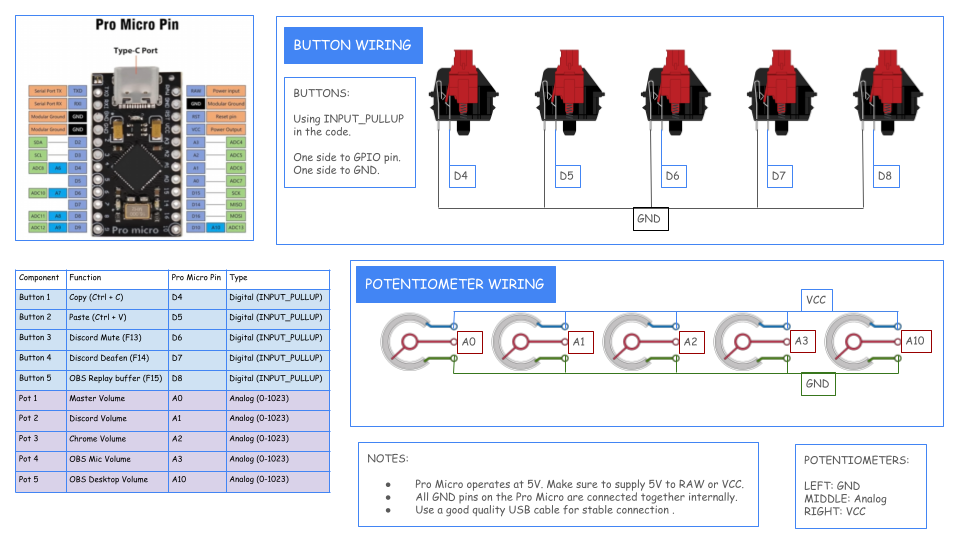
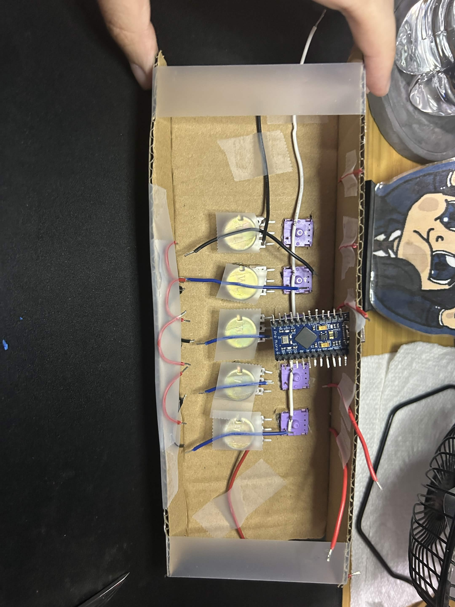
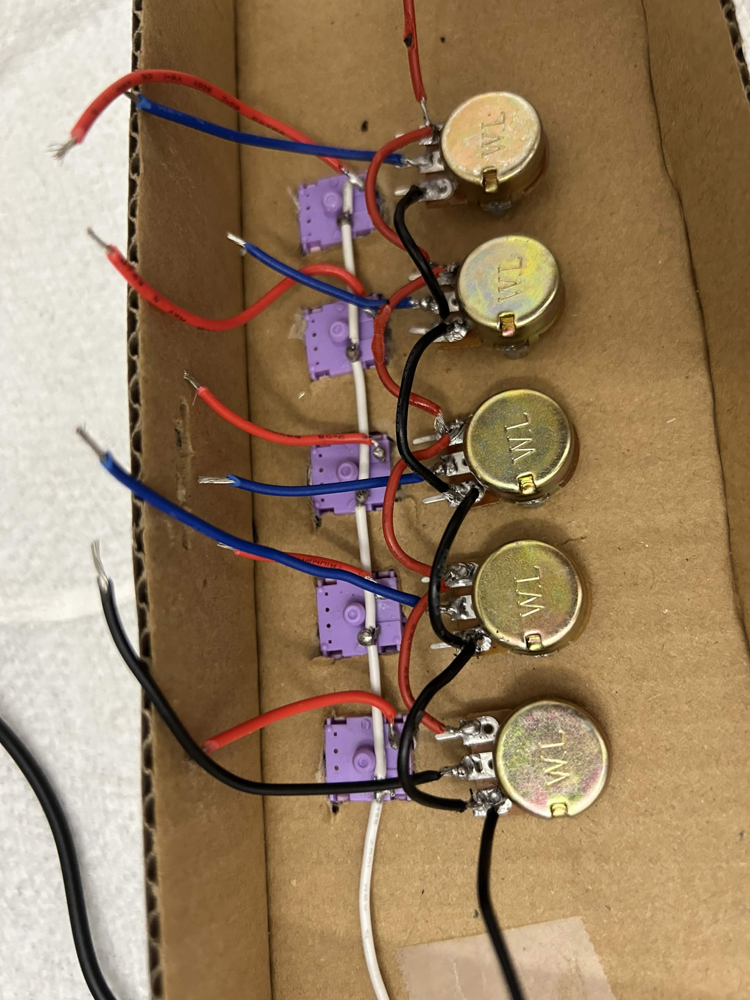
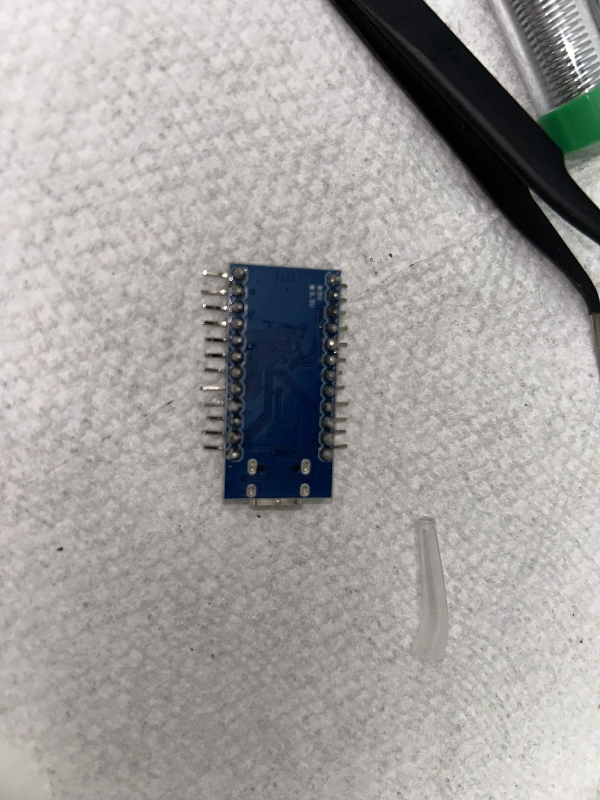
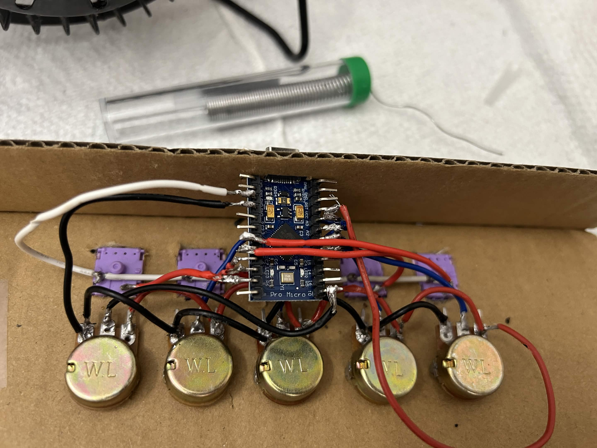
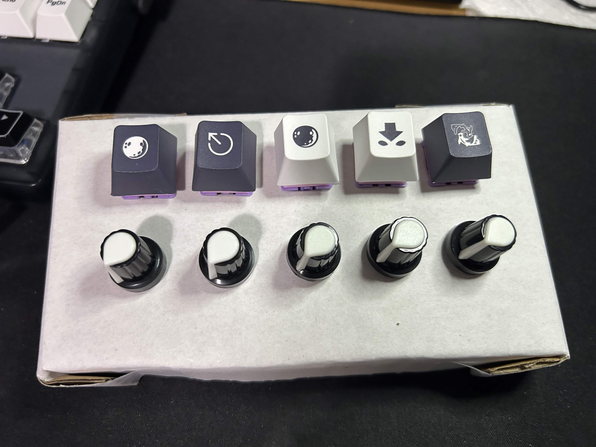

# DIY Stream Deck

A custom USB Stream Deck built using an ATmega32U4 Pro Micro, 5 mechanical switches, and 5 potentiometers.

The device acts as a USB keyboard using the Arduino `Keyboard.h` library, allowing custom macros and hotkeys to control applications such as Discord and OBS Studio.

---

## Features

### Current Functions

| Button | Pin | Action            |
| ------ | --- | ----------------- |
| B1     | D4  | Copy (Ctrl + C)   |
| B2     | D5  | Paste (Ctrl + V)  |
| B3     | D6  | Discord Mute      |
| B4     | D7  | Discord Deafen    |
| B5     | D8  | OBS Replay Buffer |

### Potentiometers

| Pot   | Pin |
| ----- | --- |
| Pot 1 | A0  |
| Pot 2 | A1  |
| Pot 3 | A2  |
| Pot 4 | A3  |
| Pot 5 | A10 |

---

## Hardware

### Components

* ATmega32U4 Pro Micro (5V / 16MHz)
* 5 Mechanical Keyboard Switches
* 5 Potentiometers
* Wires
* USB-C Cable
* Soldering materials

---

## Pinout

### Buttons

```text
D4 -> Button 1
D5 -> Button 2
D6 -> Button 3
D7 -> Button 4
D8 -> Button 5
```

### Potentiometers

```text
A0 -> Pot 1
A1 -> Pot 2
A2 -> Pot 3
A3 -> Pot 4
A10 -> Pot 5
```

---

## Wiring

### Buttons

Each button uses the internal pull-up resistor.

GPIO Pin ---- Button ---- GND

Example:

D4 ---- Button 1 ---- GND

### Potentiometers

```text
5V  ---- Right Pin
A0  ---- Middle Pin
GND ---- Left Pin
```

The middle pin (wiper) connects to the analog input.

---

## Software Setup

### Discord

Open:

Settings -> Keybinds

Create the following keybinds:

F13 -> Toggle Mute
F14 -> Toggle Deafen

### OBS Studio

Open:

Settings -> Hotkeys

Assign:

F15 -> Save Replay Buffer

Enable Replay Buffer before using the OBS button.

---

## Project Structure

```text
DIY-StreamDeck/
│
├── firmware/
│   └── sketch_streamdeck.ino
│
├── images/
│   ├── caps.jpg
│   ├── solboard.jpg
│   └── solboth.jpg
│   └── solswitchespots.jpg
│   └── wireprep.jpg
│
├── docs/
│   └── DIY-StreamDeck.png
│
└── README.md
```

---

## Images

### Wiring Diagram



### Wire Prep



### Wiring







### Finished Build



---

## Firmware

The firmware uses:

* Arduino IDE
* Keyboard.h
* USB HID Keyboard Emulation

The Pro Micro appears as a standard USB keyboard to the operating system.

---

## Future Improvements

### Version 2

* Windows Volume Control
* Discord Volume Control
* Chrome Volume Control
* OBS Audio Mixer Integration

### Version 3

* 3D printed enclosure

---

## Version History

### v1.0

Initial release.

Features:

* 5-button macro pad
* Discord mute/deafen integration
* OBS replay buffer integration
* Potentiometer input support
* USB HID keyboard functionality

